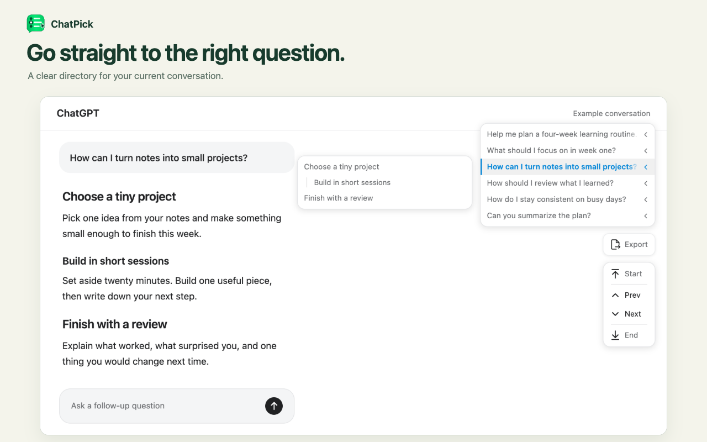

# ChatPick

[简体中文](README.zh-CN.md)

Navigate AI conversations by question and answer section.

ChatPick is a Chrome extension that puts a question directory beside your chat. Find an earlier question, revisit a section of an answer, or move straight to the beginning or end of a conversation.



## Features

- **Question navigation** — Browse your questions and jump to the one you need, even when the same question appears more than once.
- **Answer sections** — Hover a question to see its answer's headings, then select a section to jump to it.
- **Conversation export** — Download the current conversation as Markdown or a searchable PDF with Chinese text, code blocks, and tables. Partial content is clearly identified before downloading. Images and attachments are represented by text notices.
- **Quick controls** — Go to the start, previous question, next question, or bottom. The directory highlights your position as you scroll.
- **Colors that fit your chat** — Follow the website's appearance, with highlights that match each website, or choose ChatPick's default colors.
- **Comfortable motion** — Subtle interface animations respect your reduced-motion preference. Content jumps remain instant.
- **English and Chinese** — Follow the chat website's language, or choose a language in settings.

## Supported chats

| Website | Conversations |
| --- | --- |
| [ChatGPT](https://chatgpt.com/) | Regular chats, project chats, and custom GPT chats |
| [Claude](https://claude.ai/) | Regular chats and chats within projects |
| [DeepSeek](https://chat.deepseek.com/) | Saved chats |
| [Gemini](https://gemini.google.com/) | Saved chats |
| [Grok](https://grok.com/) | Saved chats |
| [Perplexity](https://www.perplexity.ai/) | Saved search conversations |
| [Qwen](https://chat.qwen.ai/) | Saved chats, including chats within projects |
| [Qianwen (千问)](https://www.qianwen.com/) | Saved chats |

Navigation appears on conversation pages. Home pages, project overviews, settings, and shared links are excluded. Answers without headings do not have a section menu. If some history is unavailable, the directory may show only messages already loaded on the page.

## Install locally

With Node.js 22.12+ and pnpm installed, run these commands in the project directory:

```sh
pnpm install
pnpm build
```

1. Open `chrome://extensions` and enable **Developer mode**.
2. Choose **Load unpacked** and select `.output/chrome-mv3`.
3. Open or reload a supported chat and use the navigator on the right.
4. Select the ChatPick toolbar icon to open settings.

If you used an earlier navigation userscript, disable it before installing ChatPick. A Chrome Web Store installation link will be added after publication.

## Settings

| Setting | Options | Default |
| --- | --- | --- |
| Appearance | Follow chat appearance, Light, Dark | Follow chat appearance |
| Colors | Follow chat colors, ChatPick default | Follow chat colors |
| Language | Follow chat language, English, 中文 | Follow chat language |
| Show export button | On, Off | On |
| Show jump buttons | On, Off | On |

Changes apply immediately to open chats. Appearance and colors can be chosen independently. You can show or hide export and jump buttons independently; the conversation directory remains available. Open **Privacy policy** at the bottom of the settings panel to read the policy in English or Chinese.

## Privacy

ChatPick reads your current conversation using your existing sign-in to provide navigation and local exports. Chat content is processed in your browser and is not sent to the developer. Only appearance, language, color, and button visibility preferences are saved in extension storage. There are no ads or analytics, and ChatPick does not send, edit, or delete chat messages.

Read the [privacy policy](docs/privacy-policy.md) for data handling details. For privacy questions or support, contact [hi@yl.do](mailto:hi@yl.do).

## Development

For setup, source organization, and browser regression checks, see the [development guide](docs/development.md). Coding agents should also read [AGENTS.md](AGENTS.md).

## License

[MIT](LICENSE)

ChatPick is an independent project and is not affiliated with the supported AI providers.
