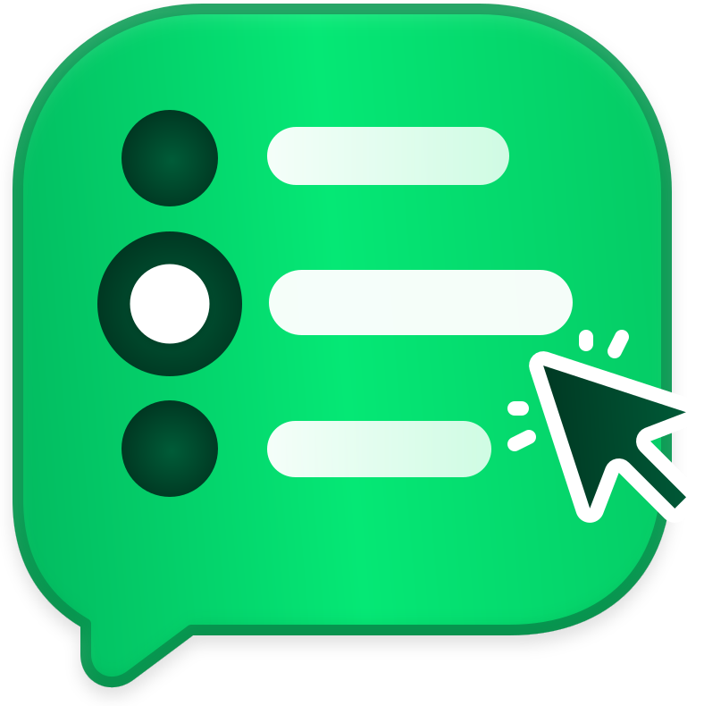

#  ChatPick

[简体中文](README.zh-CN.md)

Navigate AI chats by question and answer section. Export conversations as Markdown or PDF.

ChatPick is a browser extension that puts a question directory beside your chat. Find an earlier question, revisit a section of an answer, or move straight to the beginning or end of a conversation. It has separate desktop builds for Chrome, Firefox, and Microsoft Edge.


## Features

- **Question navigation** — Browse your questions and jump to the one you need, even when the same question appears more than once.
- **Readable links** — Links in questions are underlined, with Markdown links shown by their label.
- **Answer sections** — Hover a question to see its answer's headings, then select a section to jump to it.
- **Conversation export** — Download the current conversation as Markdown or a searchable PDF with Chinese text, code blocks, and tables. Partial content is clearly identified before downloading. Images and attachments are represented by text notices.
- **Quick controls** — Go to the start, previous question, next question, or bottom. The directory highlights your position as you scroll.
- **Colors that fit your chat** — Follow the website's appearance, with highlights that match each website, or choose ChatPick's default colors.
- **Comfortable motion** — Subtle interface animations respect your reduced-motion preference. Content jumps remain instant.
- **English and Chinese** — Follow the chat website's language, or choose a language in settings.

## Supported chats

| Website | Conversations |
| --- | --- |
| [ChatGPT](https://chatgpt.com/) | Regular chats, project chats, custom GPT chats, and Dots |
| [Claude](https://claude.ai/) | Regular chats and chats within projects |
| [DeepSeek](https://chat.deepseek.com/) | Saved chats |
| [Gemini](https://gemini.google.com/) | Saved chats |
| [Grok](https://grok.com/) | Saved chats |
| [Perplexity](https://www.perplexity.ai/) | Saved search conversations |
| [Qwen](https://chat.qwen.ai/) | Saved chats, including chats within projects |
| [Qianwen (千问)](https://www.qianwen.com/) | Saved chats |

Navigation appears on conversation pages. Home pages, project overviews, settings, and shared links are excluded. Answers without headings do not have a section menu. If some history is unavailable, the directory may show only messages already loaded on the page.

## Install locally

With Node.js 22.12+ and pnpm installed, run these commands in the project directory:

```sh
pnpm install
pnpm build:all
```

Choose the build for your browser:

| Browser | Build only this browser | Local installation |
| --- | --- | --- |
| Chrome | `pnpm build:chrome` (also `pnpm build`) | Open `chrome://extensions`, enable **Developer mode**, choose **Load unpacked**, and select `.output/chrome-mv3`. |
| Firefox desktop 140+ | `pnpm build:firefox` | Open `about:debugging#/runtime/this-firefox`, choose **Load Temporary Add-on**, and select `.output/firefox-mv3/manifest.json`. |
| Microsoft Edge | `pnpm build:edge` | Open `edge://extensions`, enable **Developer mode**, choose **Load unpacked**, and select `.output/edge-mv3`. |

Open or reload a supported chat and use the navigator. It appears on the right by default; choose Left in settings to move it. Select the ChatPick toolbar icon to open settings. Firefox's temporary installation lasts until the browser restarts; regular distribution requires a Mozilla-signed package. See [Mozilla's installation guide](https://extensionworkshop.com/documentation/develop/temporary-installation-in-firefox/).

If you used an earlier navigation userscript, disable it before installing ChatPick. Chrome Web Store, Firefox Add-ons, and Microsoft Edge Add-ons installation links will be added after publication. See the [distribution guide](docs/browser-distribution.md) for ZIP packaging and Firefox signing.

## Settings

| Setting | Options | Default |
| --- | --- | --- |
| Enable on this website | On, Off; saved separately for each website | On |
| Appearance | Follow chat appearance, Light, Dark | Follow chat appearance |
| Colors | Follow chat colors, ChatPick default | Follow chat colors |
| Language | Follow chat language, English, 中文 | Follow chat language |
| Position | Left, Right | Right |
| Show export button | On, Off | On |
| Show jump buttons | On, Off | On |

The switch at the top enables ChatPick for the current website. All supported websites are enabled by default. Turning it off removes ChatPick navigation and restores any native navigation it had replaced. Your choice is remembered for that website and does not affect other websites.

Changes apply immediately to open chats. Appearance and colors can be chosen independently. You can show or hide export and jump buttons independently; the conversation directory remains available. Open **Privacy policy** at the bottom of the settings panel to read the policy in English or Chinese.

## Privacy

ChatPick reads your current conversation using your existing sign-in to provide navigation and local exports. Chat content is processed in your browser and is not sent to the developer. Only website enablement, appearance, language, color, navigation position, and button visibility preferences are saved in extension storage. There are no ads or analytics, and ChatPick does not send, edit, or delete chat messages.

Read the [privacy policy](docs/privacy-policy.md) for data handling details. For privacy questions or support, contact [hi@yl.do](mailto:hi@yl.do).

## Development

For setup, source organization, and browser regression checks, see the [development guide](docs/development.md). Coding agents should also read [AGENTS.md](AGENTS.md).

## License

[MIT](LICENSE)

ChatPick is an independent project and is not affiliated with the supported AI providers.
