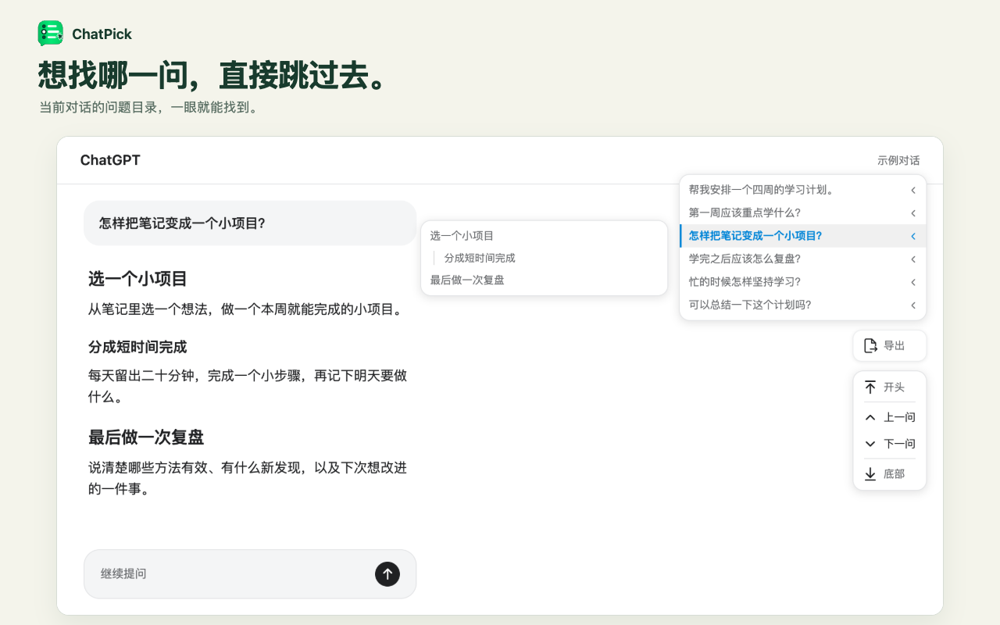

#  ChatPick

[English](README.md)

按问题和回答章节快速跳转 AI 对话，支持 Markdown 和 PDF 导出。

ChatPick 是一个浏览器扩展，在聊天旁边提供问题目录，帮助你找到之前的提问、回看回答中的某一节，或直接返回对话开头和底部。提供 Chrome、Firefox 和 Microsoft Edge 桌面版的独立构建。



## 功能

- **问题导航**：浏览提问目录，点击即可跳转；相同问题出现多次时也能分别定位。
- **链接显示**：提问中的链接带下划线，Markdown 链接只显示链接文字。
- **回答章节**：悬停在问题上，查看对应回答的标题目录，点击即可跳转到某一节。
- **会话导出**：将当前会话下载为 Markdown 或可搜索的 PDF，支持中文、代码块和表格；内容不完整时会在下载前提示。图片和附件以文字说明保留。
- **快捷控制**：前往开头、上一个问题、下一个问题和底部，目录随滚动高亮当前位置。
- **跟随聊天配色**：适配网页的明暗和配色，使用各网站自己的主题色，也可选择 ChatPick 默认配色。
- **舒适动效**：界面有轻量动画，并尊重减少动态效果偏好。内容跳转保持即时。
- **中英文界面**：跟随聊天网页的语言，也可以在设置中手动选择。

## 支持的聊天

| 网站 | 对话 |
| --- | --- |
| [ChatGPT](https://chatgpt.com/) | 普通聊天、项目聊天、自定义 GPT 聊天和 Dots |
| [Claude](https://claude.ai/) | 普通聊天和项目内的聊天 |
| [DeepSeek](https://chat.deepseek.com/) | 已保存的聊天 |
| [Gemini](https://gemini.google.com/) | 已保存的聊天 |
| [Grok](https://grok.com/) | 已保存的聊天 |
| [Perplexity](https://www.perplexity.ai/) | 已保存的搜索对话 |
| [Qwen](https://chat.qwen.ai/) | 已保存的聊天，包括项目内聊天 |
| [千问](https://www.qianwen.com/) | 已保存的聊天 |

导航只在对话页面显示，不出现在首页、项目概览、设置页和分享页面。没有标题的回答不会显示章节目录。部分历史内容无法获取时，目录可能只显示页面已经加载的消息。

## 本地安装

准备 Node.js 22.12+ 和 pnpm，在项目目录运行：

```sh
pnpm install
pnpm build:all
```

按浏览器选择对应构建：

| 浏览器 | 仅构建此浏览器 | 本地安装 |
| --- | --- | --- |
| Chrome | `pnpm build:chrome`（也可用 `pnpm build`） | 打开 `chrome://extensions`，启用「开发者模式」，点击「加载已解压的扩展程序」，选择 `.output/chrome-mv3`。 |
| Firefox 桌面版 140+ | `pnpm build:firefox` | 打开 `about:debugging#/runtime/this-firefox`，点击「临时载入附加组件」，选择 `.output/firefox-mv3/manifest.json`。 |
| Microsoft Edge | `pnpm build:edge` | 打开 `edge://extensions`，启用「开发者模式」，点击「加载解压缩的扩展」，选择 `.output/edge-mv3`。 |

打开或刷新一个受支持的聊天页面，使用右侧导航。点击工具栏中的 ChatPick 图标打开设置。Firefox 临时安装在浏览器重启后失效；正式分发需要 Mozilla 签名包，详见 [Mozilla 安装说明](https://extensionworkshop.com/documentation/develop/temporary-installation-in-firefox/)。

如果使用过旧版导航脚本，请先停用。Chrome 网上应用店、Firefox 附加组件和 Microsoft Edge 加载项的安装链接将在发布后补充。ZIP 打包和 Firefox 签名见[分发指南](docs/browser-distribution.md)。

## 设置

| 设置 | 可选项 | 默认值 |
| --- | --- | --- |
| 在此网站启用 | 开启、关闭；各网站分别保存 | 开启 |
| 明暗 | 跟随网页明暗、浅色、深色 | 跟随网页明暗 |
| 配色 | 跟随网页配色、ChatPick 默认 | 跟随网页配色 |
| 语言 | 跟随网页语言、English、中文 | 跟随网页语言 |
| 显示导出按钮 | 开启、关闭 | 开启 |
| 显示跳转按钮 | 开启、关闭 | 开启 |

顶部开关控制当前网站是否启用 ChatPick，所有支持的网站默认开启。关闭后移除 ChatPick 导航，并恢复此前替换的网站原生导航。选择按网站保存，不影响其他网站。

设置会立即应用到已打开的聊天。明暗和配色可以独立选择。导出按钮和跳转按钮可以分别显示或隐藏，问题目录会继续显示。点击设置面板底部的「隐私政策」，可阅读英文或中文政策。

## 隐私

ChatPick 使用已有登录状态读取当前对话，以提供导航和本地导出。聊天内容在浏览器中处理，不会发送给开发者。扩展存储只保存网站启用状态、明暗、语言、配色和按钮显示设置。扩展没有广告或分析统计，也不会发送、编辑或删除聊天消息。

数据处理详情见[隐私政策](docs/privacy-policy.zh-CN.md)。隐私问题或支持请求请联系 [hi@yl.do](mailto:hi@yl.do)。

## 开发

安装开发环境、了解源码职责和运行浏览器回归，请阅读[开发指南](docs/development.md)。开发代理还应阅读 [AGENTS.md](AGENTS.md)。

## 许可证

[MIT](LICENSE)

ChatPick 是独立项目，与所支持的 AI 平台没有隶属关系。
